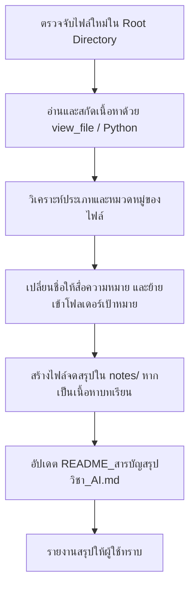

# Skill: การอ่าน วิเคราะห์ และจัดระเบียบไฟล์ใหม่ (Read and Organize New Files)

คู่มือขั้นตอนปฏิบัติงานมาตรฐาน (SOP) สำหรับ Antigravity ในการตรวจจับ อ่านเนื้อหา แยกหมวดหมู่ ย้ายไฟล์เข้าโฟลเดอร์ที่ถูกต้อง และสร้างสรุปสาระสำคัญโดยอัตโนมัติ

---

## 1. วัตถุประสงค์และโครงสร้างโฟลเดอร์มาตรฐาน

เมื่อมีไฟล์ใหม่ถูกเพิ่มเข้ามาใน Root Workspace ให้จำแนกและจัดระเบียบตาม 4 หมวดหมู่หลัก:

| หมวดหมู่โฟลเดอร์ | ประเภทไฟล์ที่รองรับ | ตัวอย่างไฟล์ |
| :--- | :--- | :--- |
| **📁 `เอกสาร/`** | ชีทเรียน, ตำรา, เอกสารประกอบการสอน, เอกสารราชการ, แบบฟอร์ม | `บทที่ 1c.pdf`, `ใบสมัคร_*.pdf`, `handout_*.pdf` |
| **📁 `สไลด์/`** | สไลด์บรรยาย Presentation, ไฟล์นำเสนอ | `Chapter-*.pdf`, `Lecture_*.pptx`, `Slide_*.pdf` |
| **📁 `แลบ/`** | ใบงานปฏิบัติการ, โจทย์เขียนโปรแกรม, การบ้าน | `Lab-*.pdf`, `บทที่ *l.pdf`, `assignment_*.pdf` |
| **📁 `notes/`** | ไฟล์สรุปเนื้อหา Markdown, เฉลยแบบฝึกหัด, สารบัญ | `01_บทที่_1_*.md`, `README_สารบัญสรุปวิชา_AI.md` |

---

## 2. ขั้นตอนการปฏิบัติงาน (Step-by-Step Workflow)

### ขั้นตอนที่ 1: ตรวจจับไฟล์ใหม่ (Detecting Incoming Files)
1. ตรวจสอบไฟล์ที่อยู่ใน Root Directory ที่ยังไม่ได้ถูกจัดหมวดหมู่ โดยใช้เครื่องมือ `list_dir`
2. กรองเฉพาะไฟล์ปกติ (ไม่รวมโฟลเดอร์ระบบ เช่น `.agents`, `.git`, `notes`, `เอกสาร`, `สไลด์`, `แลบ`)

### ขั้นตอนที่ 2: อ่านและวิเคราะห์เนื้อหา (Reading & Analyzing Content)
1. **สำหรับไฟล์ PDF:**
   * ใช้เครื่องมือ `view_file` เพื่อดูหน้าเอกสารและการทำ OCR
   * หรือใช้คำสั่ง Python ผ่าน `pypdf` สกัดข้อความภาษาไทย/อังกฤษอย่างครบถ้วน
2. **สำหรับไฟล์รูปภาพ / Scan:**
   * ใช้ `view_file` เพื่อดูภาพและข้อความที่ตรวจจับได้
3. **สำหรับไฟล์โค้ดและข้อความ (Text/Markdown/Code):**
   * ใช้ `view_file` หรืออ่านเนื้อหาโดยตรง

### ขั้นตอนที่ 3: จัดหมวดหมู่และย้ายไฟล์ (Categorizing & Moving)
1. วิเคราะห์ชื่อและเนื้อหา:
   * หากเป็นสไลด์บรรยาย $\rightarrow$ ย้ายไป `สไลด์/`
   * หากเป็นใบงาน/Lab/การบ้าน $\rightarrow$ ย้ายไป `แลบ/`
   * หากเป็นชีทคำอธิบายบทเรียนหรือเอกสารทั่วไป $\rightarrow$ ย้ายไป `เอกสาร/`
2. เปลี่ยนชื่อไฟล์ให้สื่อความหมายชัดเจน (Descriptive Name) หากชื่อเดิมไม่ชัดเจน เช่น `Tobe (1).pdf` $\rightarrow$ `ใบสมัคร_TO_BE_NUMBER_ONE.pdf`
3. ย้ายไฟล์ด้วยคำสั่ง Python `shutil.move()`

### ขั้นตอนที่ 4: การสรุปเนื้อหาและอัปเดตสารบัญ (Delegation to Summarization Skill)
1. หากไฟล์ใหม่เป็นเนื้อหาบทเรียนหรือการบรรยาย ให้เรียกใช้และปฏิบัติตาม **Skill: [summarize-study-notes](file:///d:/3term1/AI/.agents/skills/summarize-study-notes/SKILL.md)**
2. สร้างไฟล์สรุปใน `notes/` ตามมาตรฐาน และอัปเดตสารบัญใน `notes/README_สารบัญสรุปวิชา_AI.md`

### ขั้นตอนที่ 5: รายงานผลให้ผู้ใช้ทราบ (User Notification)
แจ้งผลการดำเนินการให้ผู้ใช้ทราบอย่างกระชับ พร้อมระบุ:
* ข้อมูลสรุปเนื้อหาที่อ่านได้จากไฟล์ใหม่
* โฟลเดอร์ปลายทางที่นำไฟล์ไปจัดเก็บ
* ลิงก์ไปยังไฟล์ต้นฉบับและไฟล์สรุป

---

## 3. สคริปต์ตัวช่วยจัดระเบียบอัตโนมัติ (Helper Script)

สามารถเรียกใช้สคริปต์อัตโนมัติได้ที่:
`python .agents/skills/read-and-organize-files/scripts/organize_files.py`
