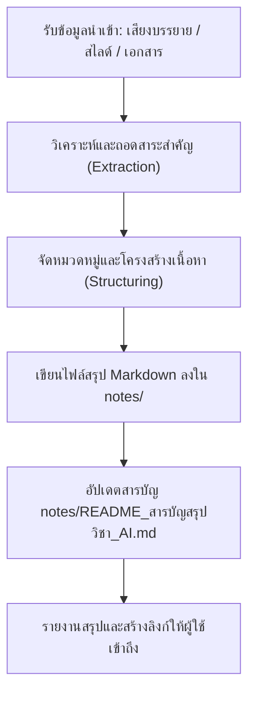
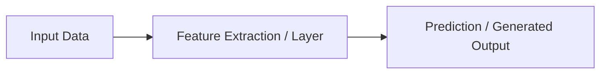

# Skill: การสรุปเนื้อหาบทเรียนและการบรรยาย (Summarize Study Notes & Lectures)

คู่มือขั้นตอนปฏิบัติงานมาตรฐาน (SOP) สำหรับ Antigravity ในการวิเคราะห์และสรุปเนื้อหาบทเรียนจากการบรรยายสด (ไฟล์เสียง), สไลด์นำเสนอ (PDF/PPTX), ชีทคำสอน, และแบบฝึกหัด จัดทำเป็นเอกสาร Markdown สรุปบทเรียนที่มีโครงสร้างชัดเจน สวยงาม ครบถ้วน และพร้อมสำหรับการทบทวนและเตรียมสอบ

---

## 1. วัตถุประสงค์และขอบเขตการทำงาน

เมื่อได้รับคำสั่งให้สรุปเนื้อหาบทเรียนหรือเมื่อมีข้อมูลการบรรยายใหม่ (เช่น ไฟล์เสียง, สไลด์, บันทึกการสอน):
1. **สกัดสาระสำคัญอย่างครบถ้วน:** ครอบคลุมทั้งทฤษฎีหลัก, สูตรทางคณิตศาสตร์, ลำดับขั้นตอน (Algorithms), แผนผังสถาปัตยกรรม (Architectures)
2. **เก็บประเด็นเชิงลึกจากผู้สอน:** จดบันทึกตัวอย่างจริง, ประสบการณ์ทำงาน, เคสศึกษาวิจัยจริง, สเปกฮาร์ดแวร์/ต้นทุน, และข้อสังเกตที่อาจารย์เน้นย้ำในชั้นเรียน
3. **จัดระเบียบและสร้างไฟล์สรุปใน `notes/`:** บันทึกในรูปแบบไฟล์ Markdown มาตรฐาน
4. **อัปเดตสารบัญวิชา:** บันทึกลิงก์และสรุปย่อใน `notes/README_สารบัญสรุปวิชา_AI.md`

---

## 2. ขั้นตอนการปฏิบัติงาน (Workflow)

### ขั้นตอนที่ 1: การวิเคราะห์ข้อมูลนำเข้า (Input Processing)
* **กรณีเป็นไฟล์เสียงบรรยาย (Audio Recordings):**
  * ฟังและถอดประเด็นหลัก เรียงลำดับตามเวลาและหัวข้อที่อาจารย์บรรยาย
  * ดักจับ "เกร็ดความรู้/เคสศึกษาจริง" ที่ไม่มีในสไลด์ (เช่น โครงการวิจัยที่อาจารย์ทำ, การเปรียบเทียบการใช้งานเครื่องมือ AI จริง)
  * บันทึกคำเตือน ข้อควรระวัง หรือประเด็นที่อาจารย์ระบุว่ามักออกสอบ
* **กรณีเป็นสไลด์บรรยาย (PDF / Slides):**
  * สกัดหัวข้อหลัก, หัวข้อย่อย, นิยามคำศัพท์เฉพาะ, และไดอะแกรม
* **กรณีเป็นโจทย์/ใบงาน (Labs / Assignments):**
  * สรุปวัตถุประสงค์ของแลบ, ขั้นตอนการทดลอง, และสรุปผลลัพธ์สำคัญ

### ขั้นตอนที่ 2: โครงสร้างมาตรฐานของไฟล์สรุป (Standard Note Structure)

ทุกไฟล์สรุปในโฟลเดอร์ `notes/` ควรประกอบด้วยส่วนประกอบดังต่อไปนี้:

1. **ส่วนหัวเอกสาร (Header & Metadata):**
   * ชื่อบทเรียน / หัวข้อการบรรยาย
   * วันที่หรือคาบเรียนที่เกี่ยวข้อง
2. **เนื้อหาเชิงทฤษฎีและแนวคิดหลัก (Core Concepts):**
   * นิยามคำศัพท์สำคัญ (Terminology)
   * สมการทางคณิตศาสตร์ (LaTeX format เช่น `$P(Y \mid X)$`, `$$\sum w_i x_i$$`)
   * หลักการทำงานแบบเป็นขั้นเป็นตอน (Step-by-Step Mechanism)
3. **แผนภาพแสดงสถาปัตยกรรมและกระบวนการ (Visual Diagrams):**
   * ใช้ **Mermaid Diagram** แสดง Flowchart, Pipeline หรือ Architecture เสมอ
4. **ตารางเปรียบเทียบและสรุปประเด็นสำคัญ (Comparison Matrices):**
   * ตารางเปรียบเทียบจุดเด่น-จุดด้อย ข้อแตกต่างระหว่างโมเดล/เทคนิคต่างๆ
5. **เคสศึกษาและเกร็ดเชิงปฏิบัติจากผู้สอน (Lecturer Insights & Real-world Cases):**
   * ตัวอย่างงานจริง เช่น ต้นทุนฮาร์ดแวร์, การแก้ปัญหาข้อมูลไม่พอ, การเลือกใช้เครื่องมือ
6. **แนวข้อสอบและคำถามทบทวนท้ายบท (Exam Review & Q&A):**
   * คำถามทดสอบความเข้าใจ พร้อมแนวทางการตอบอย่างละเอียด

### ขั้นตอนที่ 3: กฎการตั้งชื่อไฟล์และการจัดเก็บ (Naming Conventions)

* เก็บไฟล์ทั้งหมดไว้ที่ไดเรกทอรี: `notes/`
* รูปแบบการตั้งชื่อไฟล์:
  * บทเรียนตามหลักสูตร: `XX_บทที่_X_<ชื่อบทเรียน>.md` (เช่น `09_บทที่_9_การเรียนรู้ยุคใหม่.md`)
  * บันทึกการบรรยายสด/เคสศึกษาเฉพาะ: `XX_บรรยายสด_<ชื่อหัวข้อ>.md` (เช่น `09_บรรยายสด_บทที่_9_Generative_AI_และ_Case_Study.md`)

### ขั้นตอนที่ 4: การอัปเดตสารบัญหลัก (Index Updating)

ทุกครั้งที่มีการสร้างหรืออัปเดตไฟล์สรุปใหม่ใน `notes/`:
1. ตรวจสอบไฟล์ [notes/README_สารบัญสรุปวิชา_AI.md](file:///d:/3term1/AI/notes/README_สารบัญสรุปวิชา_AI.md)
2. เพิ่มหัวข้อ ลิงก์แบบ `file:///` ไปยังไฟล์ใหม่ และใส่คำอธิบายสั้นๆ เกี่ยวกับเนื้อหาที่บันทึก

---

## 3. ตัวอย่างการใช้คำสั่ง Mermaid และ Formatting ในโน้ต

### ตัวอย่าง Mermaid Pipeline:

### ตัวอย่าง Alert Box:
> [!NOTE]
> ประเด็นสำคัญที่อาจารย์เน้นย้ำในห้องเรียนสำหรับการเตรียมสอบ

---

## 4. มาตรฐานคุณภาพของเนื้อหา (Quality Checklist)
- [ ] มีการจัดลำดับหัวข้อจากภาพรวมลงลึกสู่รายละเอียด
- [ ] มีการใช้สัญลักษณ์ทางคณิตศาสตร์ (LaTeX) ถูกต้องสมบูรณ์
- [ ] ไม่ละทิ้งรายละเอียดตัวอย่างจริงหรือเคสศึกษาที่อาจารย์เล่าในห้อง
- [ ] มีตารางเปรียบเทียบช่วยจำ
- [ ] มีลิงก์เชื่อมโยงไปยังไฟล์ที่เกี่ยวข้องเสมอ
