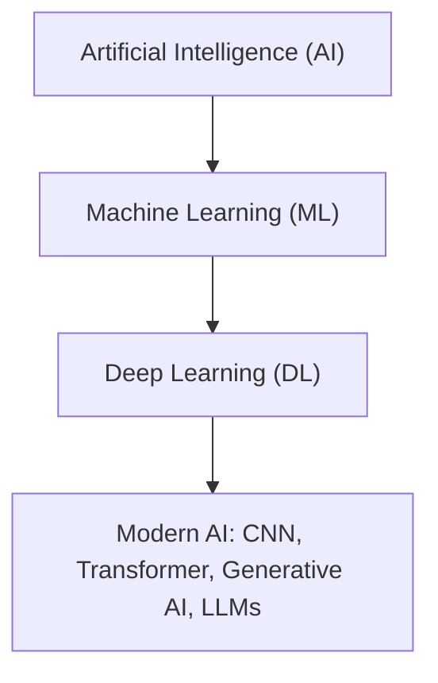
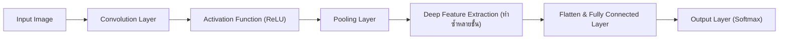

# สรุปบทที่ 9: ปัญญาประดิษฐ์สมัยใหม่และการเรียนรู้ยุคใหม่ (Modern AI: Deep Learning, CNN, Generative AI & LLMs)

---

## 1. วิวัฒนาการสู่ Modern AI และการเรียนรู้เชิงลึก (Deep Learning)

### 1.1 ความสัมพันธ์ระหว่าง AI, Machine Learning และ Deep Learning
* **Artificial Intelligence (AI):** ขอบเขตที่กว้างที่สุด ครอบคลุมระบบหรือเครื่องจักรใดๆ ที่สามารถแสดงพฤติกรรมเลียนแบบความฉลาดของมนุษย์ (เช่น Search, Logic, Rule-based systems)
* **Machine Learning (ML):** ซับเซตของ AI ที่เรียนรู้ความสัมพันธ์และสร้างแบบจำลองจากข้อมูลตัวอย่าง โดยไม่ต้องเขียนโค้ดกำหนดกฎเกณฑ์ทั้งหมดด้วยมือ
* **Deep Learning (DL):** ซับเซตของ ML ที่ใช้สถาปัตยกรรม **โครงข่ายประสาทเทียมหลายชั้น (Multi-layer Neural Networks)** ที่มีความลึกและซับซ้อน สามารถสกัดคุณลักษณะ (Features) ได้เองจากข้อมูลดิบ
* **ความแตกต่างระหว่าง Traditional AI กับ Modern AI:**
  * *Traditional AI:* พึ่งพากฎเชิงตรรกศาสตร์ (Symbolic/Logic), ต้นไม้การตัดสินใจแบบดั้งเดิม หรือฮิวริสติก ซึ่งจัดการข้อมูลขนาดใหญ่และข้อมูลที่ไม่มีโครงสร้าง (Unstructured Data เช่น ภาพ เสียง วิดีโอ ข้อความธรรมชาติ) ได้ยาก
  * *Modern AI:* ขับเคลื่อนด้วย Deep Learning และ Big Data ร่วมกับพลังประมวลผลสูง (GPUs/TPUs) มุ่งเน้นการค้นหารูปแบบ ความสัมพันธ์เชิงพื้นที่ และบริบทที่ซับซ้อนได้อย่างยืดหยุ่น



### 1.2 ข้อจำกัดของ Fully Connected Network (FCN) ต่อข้อมูลภาพ
ในบทที่ 8 เราได้ศึกษาโครงข่ายแบบเชื่อมต่อเต็มรูปแบบ (Fully Connected Network / Multi-Layer Perceptron: MLP) แต่เมื่อนำมาใช้กับข้อมูลภาพ จะพบปัญหาสำคัญ 2 ประการ:
1. **การสูญเสียโครงสร้างเชิงพื้นที่ (Loss of Spatial Information):**
   * ข้อมูลภาพไม่ใช่แค่รายการตัวเลขธรรมดา แต่ตำแหน่งของแต่ละพิกเซล (Pixel) สัมพันธ์กับพิกเซลรอบข้างอย่างยิ่ง (เช่น เส้น ขอบ มุม ลวดลาย)
   * หากนำภาพขนาด $28 \times 28$ หรือ $1024 \times 1024$ มาคลี่เป็นเวกเตอร์หนึ่งมิติ (Flattening) ค่าพิกเซลที่เคยอยู่ติดกันในแนวดิ่งจะถูกแยกห่างจากกัน ทำให้โครงข่ายมองไม่เห็นความสัมพันธ์เชิงรูปทรง
2. **ปัญหาพารามิเตอร์ระเบิด (Parameter Explosion & High Computational Cost):**
   * หากภาพสีขนาดปกติ เช่น $200 \times 200 \times 3$ ช่องสี มีพิกเซลรวม 120,000 ค่า หากเชื่อมต่อไปยัง Hidden Layer ที่มี 1,000 นิวรอน จะต้องใช้ค่าน้ำหนัก (Weights) มากกว่า 120 ล้านตัวในชั้นเดียว ส่งผลให้โมเดลฝึกช้ามาก สิ้นเปลืองหน่วยความจำ และเกิดปัญหา **Overfitting** ได้ง่ายมาก

### 1.3 จุดเปลี่ยนสำคัญ: Automatic Feature Extraction
* ในยุคก่อนหน้า วิศวกรต้องออกแบบและดึงคุณลักษณะด้วยมือ (Handcrafted Features เช่น SIFT, HOG, Haar-like) แล้วจึงส่งให้โมเดล Machine Learning จำแนก
* ใน Deep Learning สมัยใหม่ โครงข่ายสามารถทำ **การสกัดคุณลักษณะโดยอัตโนมัติ (Automatic Feature Extraction)** จากข้อมูลพิกเซลดิบได้โดยตรงผ่านกระบวนการเรียนรู้แบบ End-to-End

---

## 2. โครงข่ายประสาทเทียมแบบคอนโวลูชัน (Convolutional Neural Network: CNN)

CNN คือสถาปัตยกรรมโครงข่ายประสาทเทียมที่ถูกออกแบบมาเพื่อจัดการกับข้อมูลที่มีโครงสร้างเชิงพื้นที่ (Spatial Structure) โดยเฉพาะข้อมูลภาพดิจิทัล

### 2.1 แนวคิดหัวใจหลัก 2 ประการของ CNN
1. **Local Receptive Field (การตรวจสอบเฉพาะบริเวณ):**
   * แทนที่นิวรอนจะเชื่อมต่อกับทุกพิกเซลในภาพ นิวรอนใน CNN จะเชื่อมต่อและสนใจเฉพาะกลุ่มพิกเซลในบริเวณย่อยๆ (Local Region) ที่อยู่ติดกันเท่านั้น
2. **Parameter Sharing (การใช้พารามิเตอร์ร่วมกัน):**
   * ใช้ชุดน้ำหนัก (Filter/Kernel) ตัวเดียวกันเลื่อนสแกนทั่วทั้งภาพ หาก Filter ตัวนั้นเรียนรู้การตรวจจับเส้นขอบแนวตั้ง มันก็จะสามารถตรวจจับเส้นขอบแนวตั้งได้ทุกตำแหน่งในภาพ ไม่ว่าจะอยู่มุมซ้าย ขวา หรือกึ่งกลางภาพ (เกิดคุณสมบัติ **Translation Invariance**)

### 2.2 โครงสร้างและขั้นตอนการทำงานของ CNN (Architecture Pipeline)



#### 1) Input Image (ภาพนำเข้า)
* ข้อมูลภาพดิจิทัลจะคงรูปมิติเชิงพื้นที่:
  * **ภาพขาวดำ (Grayscale):** ข้อมูล 2 มิติ (ความกว้าง $\times$ ความสูง) เช่น $28 \times 28 \times 1$ เก็บค่าความสว่าง $0-255$
  * **ภาพสี (Color Image):** ข้อมูล 3 มิติ (ความกว้าง $\times$ ความสูง $\times$ ช่องสี RGB) เช่น $32 \times 32 \times 3$ หรือ $224 \times 224 \times 3$

#### 2) Convolution Layer และ Filter/Kernel
* **Filter (Kernel):** เมทริกซ์ของค่าน้ำหนัก (Weights) ขนาดเล็ก เช่น $3 \times 3$ หรือ $5 \times 5$
* **กระบวนการคอนโวลูชัน (Convolution Operation):** นำ Filter เลื่อนสแกนทาบลงบนแต่ละบริเวณของภาพ ทำการคูณแบบจุดต่อจุด (Element-wise multiplication) แล้วรวมผลลัพธ์เข้าด้วยกันพร้อมบวก Bias:
  $$y = f\left(\sum_{i=1}^{k \times k} w_i x_i + b\right)$$
* **Feature Map (แผนที่คุณลักษณะ):** ตารางผลลัพธ์ที่ได้จากการกวาด Filter ทั่วภาพ แสดงถึงบริเวณที่มีการตอบสนองต่อรูปแบบที่ Filter นั้นๆ สนใจ (ชั้น Convolution หนึ่งชั้นมักใช้ Filter หลายสิบถึงหลายร้อยตัว เพื่อตรวจจับรูปแบบที่หลากหลายไปพร้อมกัน)

#### 3) Activation Function (ReLU)
* ผลลัพธ์จากการคอนโวลูชันจะถูกส่งผ่านฟังก์ชันกระตุ้น นิยมใช้ **ReLU (Rectified Linear Unit)**:
  $$f(x) = \max(0, x)$$
* **หน้าที่:** ตัดค่าที่เป็นลบให้เป็น $0$ และคงค่าบวกไว้ ช่วยเพิ่มความสามารถในการเรียนรู้ความสัมพันธ์ที่ไม่เป็นเส้นตรง (Non-linearity) และช่วยให้คำนวณได้อย่างรวดเร็ว

#### 4) Pooling Layer (การลดขนาดมิติข้อมูล)
* มีหน้าที่ลดขนาดความกว้างและความสูงของ Feature Map (Downsampling) โดยยังคงรักษาข้อมูลคุณลักษณะเด่นไว้
* **Max Pooling (ที่นิยมที่สุด):** แบ่ง Feature Map ออกเป็นตารางย่อย (เช่น ขนาด $2 \times 2$) แล้วเลือกเอาเฉพาะค่าที่ **มากที่สุด** ในแต่ละตารางออกมา
* **Average Pooling:** คำนวณค่าเฉลี่ยของข้อมูลในแต่ละตารางย่อย
* **ประโยชน์ของ Pooling:**
  * ลดขนาดข้อมูลและภาระการคำนวณในชั้นถัดไป
  * ช่วยควบคุมและลดโอกาสการเกิดปัญหา Overfitting
  * เพิ่มความทนทานต่อการขยับหรือเยื้องตำแหน่งของวัตถุ (Translation Invariance)

#### 5) การเรียนรู้คุณลักษณะเป็นลำดับชั้น (Hierarchical Feature Learning)
เมื่อนำชั้น Convolution, ReLU และ Pooling มาต่อซ้อนกันหลายๆ ชั้น CNN จะเกิดการเรียนรู้คุณลักษณะจากระดับง่ายไปสู่ระดับซับซ้อน:
* **ชั้นต้น (Low-level Features):** ตรวจจับเส้นตรง เส้นขอบ มุม แสงเงา จุดสี
* **ชั้นกลาง (Mid-level Features):** รวมเส้นและขอบเข้าเป็น ลวดลาย ส่วนโค้ง วงกลม หรือรูปร่างเรขาคณิต
* **ชั้นลึก (High-level Features):** รวมรูปร่างเข้าเป็นชิ้นส่วนวัตถุที่ชัดเจน เช่น ดวงตา ปาก จมูก ล้อรถ ลายขนสัตว์ จนกระทั่งตรวจพบวัตถุทั้งชิ้น

#### 6) Fully Connected Layer และ Output Layer
* **Flattening:** นำ Feature Map จากชั้น Convolution/Pooling สุดท้ายมาคลี่เป็นเวกเตอร์ 1 มิติ
* **Fully Connected Layer (FC):** เชื่อมโยงคุณลักษณะระดับสูงทั้งหมดเพื่อวิเคราะห์และตัดสินใจ
* **Output Layer:** ใช้ฟังก์ชันอย่าง **Softmax** เพื่อแปลงคะแนนผลลัพธ์เป็นค่าความน่าจะเป็นของแต่ละคลาส (Probability Distribution) เช่น:
  $$\text{Cat: } 0.85, \quad \text{Dog: } 0.10, \quad \text{Bird: } 0.05 \implies \text{ทำนายว่าเป็น แมว}$$

### 2.3 การประยุกต์ใช้งาน CNN ในงาน Computer Vision
1. **การจำแนกภาพ (Image Classification):** ตอบคำถามว่า *"ภาพนี้คือภาพของอะไร"* (ระบุ 1 คลาสต่อภาพ เช่น ตรวจคัดแยกชนิดพืช คัดแยกขยะ)
2. **การตรวจจับวัตถุ (Object Detection):** ตอบคำถามว่า *"มีวัตถุอะไรบ้าง และอยู่ที่ตำแหน่งใดในภาพ"* โดยสร้างกรอบสี่เหลี่ยมระบุตำแหน่ง (**Bounding Box**) เช่น ระบบตรวจจับคนเดินถนนและรถยนต์ในรถยนต์ไร้คนขับ
3. **การรู้จำใบหน้า (Face Recognition):** สกัดคุณลักษณะของใบหน้าและตำแหน่งอวัยวะเพื่อยืนยันตัวตน (Authentication) หรือระบบความปลอดภัย
4. **การวิเคราะห์ภาพทางการแพทย์ (Medical Image Analysis):** ช่วยแพทย์ตรวจจับความผิดปกติ เช่น ก้อนเนื้อ มะเร็ง รอยโรคในภาพ X-Ray, CT Scan, MRI
5. **การตรวจสอบคุณภาพในอุตสาหกรรม (Quality Inspection):** ใช้กล้องตรวจจับรอยแตกร้าว ตำหนิ หรือชิ้นส่วนที่ประกอบไม่สมบูรณ์บนสายพานการผลิตแบบอัตโนมัติ

---

## 3. ปัญญาประดิษฐ์เชิงสร้างสรรค์ (Generative AI)

### 3.1 การเปรียบเทียบระหว่าง Discriminative AI และ Generative AI

| มิติการเปรียบเทียบ | Discriminative AI (AI แบบจำแนก/ทำนาย) | Generative AI (AI เชิงสร้างสรรค์) |
| :--- | :--- | :--- |
| **เป้าหมายหลัก** | จำแนก ตัดสินใจ หรือทำนายคลาสของข้อมูล | สร้างข้อมูลหรือเนื้อหาชุดใหม่ที่สมจริง |
| **มุมมองทางสถิติ** | ประมาณค่าความน่าจะเป็นแบบมีเงื่อนไข $P(Y \mid X)$ | ประมาณค่าการกระจายตัวของข้อมูล $P(X)$ หรือ $P(X, Y)$ |
| **คำถามที่ใช้ตอบ** | "ข้อมูลนี้คืออะไร?", "จัดอยู่ในกลุ่มใด?" | "จงสร้างเนื้อหาใหม่ตามเงื่อนไขหรือบริบทนี้" |
| **ตัวอย่างงาน** | Image Classification, Spam Detection, Sentiment Analysis | Text Generation, Image Generation, Code Generation |
| **โมเดลตัวอย่าง** | CNN, SVM, Logistic Regression, Decision Tree | GAN, VAE, Diffusion Models, Transformer (LLMs) |

### 3.2 สื่อและข้อมูลที่ Generative AI สามารถสร้างได้ (Modalities)
1. **ข้อความ (Text Generation):** เขียนบทความ แต่งนิทาน สรุปเอกสาร ร่างอีเมล สนทนาโต้ตอบ
2. **รูปภาพ (Image Generation):** วาดภาพดิจิทัล สร้างภาพกราฟิกจากคำบรรยาย (Text-to-Image) เช่น Midjourney, Stable Diffusion
3. **เสียงและดนตรี (Audio Generation):** สังเคราะห์เสียงพูดเสมือนจริง (Text-to-Speech) แต่งเพลง ทำเสียงประกอบ
4. **วิดีโอและภาพเคลื่อนไหว (Video Generation):** แปลงบทบรรยายเป็นวิดีโอ (Text-to-Video) หรือสร้างแอนิเมชัน
5. **โปรแกรมและซอร์สโค้ด (Code Generation):** เขียนโค้ดตามคำสั่งภาษาธรรมชาติ ช่วยแก้ไขบัก (Debug) อธิบายโค้ด และเขียน Test Case

### 3.3 ตระกูลโมเดลเชิงสร้างสรรค์ที่สำคัญ (Generative Model Architectures)
* **1) Generative Adversarial Network (GAN):**
  * ประกอบด้วย 2 โครงข่ายที่ฝึกฝนโดยการแข่งขันกันเอง (Adversarial Process):
    * **Generator (ผู้สร้าง):** พยายามสร้างข้อมูลเท็จขึ้นมาให้แนบเนียนที่สุด
    * **Discriminator (ผู้ตรวจสอบ):** พยายามตรวจสอบและแยกแยะว่าข้อมูลไหนคือของจริง ข้อมูลไหนคือของปลอม
    * เมื่อฝึกไปเรื่อยๆ Generator จะเก่งขึ้นจนสามารถสร้างข้อมูลที่เหมือนจริงอย่างยิ่ง
* **2) Variational Autoencoder (VAE):**
  * ใช้ **Encoder** บีบอัดข้อมูลเข้าสู่ Latent Space (ปริภูมิแฝงที่เก็บรูปแบบหลักในรูปการแจกแจงความน่าจะเป็น) จากนั้นใช้ **Decoder** สุ่มสร้างข้อมูลใหม่ขึ้นมาจาก Latent Space
* **3) Diffusion Model (แบบจำลองการแพร่):**
  * ทำงานผ่าน 2 ขั้นตอนหลัก:
    * *Forward Process:* ค่อยๆ เติมสัญญาณรบกวน (Gaussian Noise) ลงในภาพทีละระดับจนกลายเป็นคลื่นรบกวนสุ่มสมบูรณ์
    * *Reverse Process (Denoising):* ฝึกโครงข่ายประสาทเทียมให้เรียนรู้การ **ขจัด Noise ออกทีละสเต็ป** จนกู้คืนกลับมาเป็นภาพจริงที่คมชัด
  * เป็นเทคโนโลยีเบื้องหลังของโมเดลสร้างภาพและวิดีโอยุคใหม่ (เช่น DALL-E 3, Midjourney, Stable Diffusion)
* **4) Transformer:**
  * สถาปัตยกรรมโครงข่ายประสาทที่ใช้กลไก Self-Attention เป็นรากฐานสำคัญของโมเดลภาษาขนาดใหญ่ (LLMs)

---

## 4. แบบจำลองภาษาขนาดใหญ่ (Large Language Models: LLM) และสถาปัตยกรรม Transformer

### 4.1 LLM คืออะไร?
**Large Language Model (LLM)** คือโมเดล Deep Learning ขนาดมหึมาที่ประกอบด้วยพารามิเตอร์นับหมื่นล้านถึงล้านล้านตัว (Billions to Trillions of Parameters) ซึ่งได้รับการฝึกสอนด้วยคลังข้อมูลข้อความภาษาธรรมชาติขนาดมหาศาลจากทั่วโลก จนสามารถเข้าใจโครงสร้างภาษา เชื่อมโยงความรู้ ตอบคำถาม สรุปความ และให้เหตุผลได้

### 4.2 หลักการทำงาน: Next Token Prediction
* พื้นฐานการทำงานของ LLM ไม่ใช่การค้นหาคำตอบที่มีอยู่แล้วในฐานข้อมูลแบบ Search Engine แต่คือ **การทำนายความน่าจะเป็นของ Token ถัดไป (Next Token Prediction)**:
  $$P(T_{n+1} \mid T_1, T_2, \dots, T_n)$$
* โมเดลจะอ่านข้อความนำเข้า คำนวณความน่าจะเป็นของ Token ที่ควรจะตามมา จากนั้นสุ่มเลือก Token ที่เหมาะสม นำมารวมกับข้อความเดิม แล้วทำนายตัวถัดไปวนซ้ำไปเรื่อยๆ (Autoregressive Generation) จนกว่าจะได้เนื้อหาที่ครบถ้วนสมบูรณ์

```
Input: "Artificial Intelligence is"
Step 1: ทำนายได้ "transforming" -> "Artificial Intelligence is transforming"
Step 2: ทำนายได้ "the"          -> "Artificial Intelligence is transforming the"
Step 3: ทำนายได้ "world"        -> "Artificial Intelligence is transforming the world"
```

### 4.3 โทเค็น (Token) และการตัดคำ (Tokenization)
* คอมพิวเตอร์ไม่เข้าใจตัวอักษรภาษาโดยตรง ข้อความต้องถูกแปลงเป็น **Token** ผ่านกระบวนการ **Tokenization** ก่อนแปลงเป็นเวกเตอร์ตัวเลข (Embedding)
* 1 Token อาจเป็นคำเต็ม ส่วนของคำ (Subword) พยางค์ ตัวอักษร หรือเครื่องหมายวรรคตอน
* **ข้อพิจารณาเรื่องภาษาไทย:**
  * ภาษาอังกฤษมีช่องว่าง (Space) คั่นระหว่างคำ ทำให้แบ่งคำได้ชัดเจน
  * ภาษาไทยเขียนคำต่อเนื่องกันโดยไม่มีช่องว่าง ทำให้ Tokenizer ทำงานซับซ้อนกว่า คำภาษาไทย 1 คำมักถูกตัดแบ่งออกเป็นหลาย Token
  * ผลลัพธ์: ประโยคภาษาไทยที่มีความยาวและความหมายเท่ากับภาษาอังกฤษ **มักกินจำนวน Token มากกว่า 2-4 เท่า** ส่งผลต่อการใช้พื้นที่ Context Window และค่าบริการ API ที่คิดตามจำนวน Token

### 4.4 บริบท (Context) และ Context Window
* **Context (บริบท):** ข้อความ คำสั่ง ข้อมูลอ้างอิง และประวัติการสนทนาทั้งหมดที่ส่งให้โมเดลใช้พิจารณาในการสร้างคำตอบ
* **Context Window:** ขีดจำกัดสูงสุดของจำนวน Token ที่โมเดลสามารถรับเข้าไปพิจารณาได้พร้อมกันในหนึ่งรอบ หากข้อความยาวเกิน Context Window ข้อมูลส่วนที่เกินจะหลุดจากการรับรู้ของโมเดล

### 4.5 สถาปัตยกรรม Transformer และกลไก Attention
ก่อนปี 2017 งานประมวลผลภาษาธรรมชาตินิยมใช้ **RNN (Recurrent Neural Network)** หรือ **LSTM** ซึ่งมีข้อจำกัดร้ายแรง:
1. ประมวลผลทีละคำตามลำดับเวลา ทำให้ไม่สามารถประมวลผลแบบคู่ขนานบน GPU ได้ (เทรนช้ามาก)
2. ปัญหาการลืมข้อมูลระยะไกล (Vanishing Gradient / Long-term Dependency): หากประโยคยาวมาก โมเดลจะลืมความหมายของคำแรกๆ

**การปฏิวัติโดย Transformer (ตีพิมพ์ในเปเปอร์ "Attention Is All You Need", 2017):**
* **Self-Attention Mechanism:** กลไกที่ทำให้นิวรอนสามารถคำนวณและวัด "ค่าน้ำหนักความสัมพันธ์ (Attention Score)" ระหว่างคำทุกคำในประโยคได้พร้อมกันโดยตรง ไม่ว่าคำเหล่านั้นจะอยู่ห่างกันเพียงใด ตัวอย่างเช่น คำว่า *"มัน"* ในประโยค *"สุนัขวิ่งไล่กระรอกเพราะมันกลัว"* กลไก Attention จะเชื่อมโยงได้ว่า *"มัน"* สัมพันธ์กับ *"กระรอก"* มากที่สุด
* **Parallel Processing (การประมวลผลแบบคู่ขนาน):** ข้อความทั้งหมดถูกป้อนเข้าสู่โครงข่ายพร้อมกัน ทำให้สามารถฝึกบนคลัสเตอร์ GPU ขนาดใหญ่ได้อย่างรวดเร็ว นำไปสู่การขยายขนาดโมเดลจนกลายเป็น LLM ยุคปัจจุบัน

### 4.6 วิศวกรรมคำสั่ง (Prompt Engineering)
**Prompt** คือข้อความหรือคำสั่งที่ผู้ใช้ส่งให้ Generative AI เพื่อกำหนดทิศทางและบริบทในการสร้างผลลัพธ์ โครงสร้างของ Prompt ที่มีประสิทธิภาพมักประกอบด้วย:
1. **Role (บทบาท):** กำหนดว่าต้องการให้ AI สวมบทบาทเป็นใคร เช่น *"คุณคือผู้เชี่ยวชาญด้านสถาปัตยกรรมระบบ..."*
2. **Task (เป้าหมายงาน):** ระบุสิ่งที่ต้องการให้ทำอย่างชัดเจน
3. **Context & Constraints (บริบทและข้อจำกัด):** ข้อมูลประกอบ ขอบเขตความลึก กลุ่มเป้าหมายผู้อ่าน สิ่งที่ห้ามทำ
4. **Examples (ตัวอย่าง):** เช่น การใส่ตัวอย่างคำถาม-คำตอบ (Few-shot Prompting) เพื่อให้โมเดลเข้าใจรูปแบบ
5. **Output Format (รูปแบบผลลัพธ์):** เช่น ตาราง Markdown, JSON, Bullet points หรือโค้ดภาษาใดภาษาหนึ่ง

### 4.7 แนวคิดการให้เหตุผล (Reasoning in LLMs)
โมเดล LLM ยุคใหม่ถูกพัฒนาให้สามารถ **ให้เหตุผลเชิงตรรกะเป็นขั้นตอน (Step-by-step Reasoning / Chain-of-Thought)** ได้ เช่น:
* การแก้โจทย์คณิตศาสตร์หรือตรรกศาสตร์
* การวิเคราะห์ Root Cause และหาสาเหตุข้อผิดพลาดของระบบ (Troubleshooting)
* การวางแผนขั้นตอนการทำงานทางวิศวกรรม (Workflows)
* *ข้อควรระวัง:* การ Reasoning ของ AI เกิดจากการคำนวณความสัมพันธ์ทางสถิติและลำดับของโทเค็น ไม่ใช่จิตสำนึกหรือความรู้สึกนึกคิดแบบมนุษย์

---

## 5. ข้อจำกัด จริยธรรม และความปลอดภัยของปัญญาประดิษฐ์ (AI Ethics & Safety)

### 5.1 ภาพหลอนของ AI (Hallucination)
* **นิยาม:** สภาวะที่ AI สร้างข้อมูลที่ผิดพลาด ไม่เป็นความจริง หรือแต่งเรื่องขึ้นมาเอง แต่ตอบด้วยถ้อยคำที่ดูน่าเชื่อถือ มั่นใจ และมีเหตุผลประกอบอย่างสมบูรณ์ (เช่น อ้างชื่อบทความวิจัยที่ไม่มีอยู่จริง หรือแนะนำฟังก์ชันในโค้ดที่ไม่มีในไลบรารี)
* **สาเหตุ:** เพราะโมเดลมุ่งเน้นการสร้างข้อความที่สอดคล้องกับโครงสร้างภาษาและความน่าจะเป็นตามบริบท ไม่ได้มีกลไกตรวจสอบความจริงภายนอกในตัวเอง
* **แนวทางป้องกัน:**
  * มนุษย์ต้องทำหน้าที่ตรวจสอบข้อเท็จจริง (Fact-checking) จากแหล่งข้อมูลที่น่าเชื่อถือเสมอ
  * ทดสอบ รัน และคอมไพล์โค้ดที่ AI สร้างขึ้นก่อนนำไปใช้งานจริงทุกครั้ง

### 5.2 ความเอนเอียงและอคติ (Bias in AI)
* โมเดลเรียนรู้จากข้อมูลในอดีต หากข้อมูลฝึกสอนมีอคติทางเพศ เชื้อชาติ ศาสนา วัฒนธรรม หรือชนชั้น โมเดลจะผลิตซ้ำและขยายอคติเหล่านั้นในผลลัพธ์ที่สร้างออกมา

### 5.3 ความเป็นส่วนตัวและความปลอดภัยของข้อมูล (Privacy & Data Protection)
* **กฎเหล็ก:** ห้ามส่งข้อมูลที่มีความละเอียดอ่อนเข้าสู่บริการ Public AI เด็ดขาด เช่น:
  * ข้อมูลส่วนบุคคลที่ระบุตัวตนได้ (PII), บัตรประชาชน, ข้อมูลสุขภาพ
  * รหัสผ่าน, Token, API Keys, Private Keys
  * Source Code และความลับทางการค้าขององค์กร

### 5.4 ปัญหาด้านลิขสิทธิ์และทรัพย์สินทางปัญญา (Copyright & IP)
* ข้อมูลที่นำมาเทรนโมเดลอาจมีลิขสิทธิ์คุ้มครอง นำไปสู่ข้อพิพาททางกฎหมายว่าผลงานที่ AI สร้างขึ้นละเมิดลิขสิทธิ์ต้นฉบับหรือไม่ และใครเป็นเจ้าของสิทธิ์ในผลงานที่สร้างขึ้น

### 5.5 ความมั่นคงปลอดภัยในงานวิศวกรรมซอฟต์แวร์ (Security)
* โค้ดที่สร้างโดย AI อาจแฝงช่องโหว่ด้านความปลอดภัย เช่น SQL Injection, Cross-Site Scripting (XSS), หรือการจัดการหน่วยความจำที่ผิดพลาด นักพัฒนาต้องอ่าน ทำความเข้าใจ และทำ Security Code Review เสมอ

### 5.6 แนวคิด Human + AI (Human-in-the-Loop & Oversight)
* AI ไม่ได้ถูกสร้างมาเพื่อแทนที่มนุษย์อย่างสมบูรณ์แบบ แต่ถูกนำมาใช้ในฐานะ **"เครื่องมือช่วยขยายขีดความสามารถ (Augmentation)"**
* มนุษย์มีบทบาทสำคัญที่สุดในการ:
  1. กำหนดโจทย์ เป้าหมาย และตั้งคำถามที่ถูกต้อง
  2. ตรวจสอบความถูกต้องและคุณภาพของผลลัพธ์
  3. ตัดสินใจในขั้นตอนสุดท้ายและรับผิดชอบต่อผลลัพธ์ที่เกิดขึ้น

---

## 6. ตารางเปรียบเทียบสรุปประเด็นสำคัญ (Summary Matrices)

### ตารางที่ 1: เปรียบเทียบ Fully Connected Network vs Convolutional Neural Network
| คุณลักษณะ | Fully Connected Network (FCN) | Convolutional Neural Network (CNN) |
| :--- | :--- | :--- |
| **โครงสร้างข้อมูลนำเข้า** | ข้อมูลตาราง หรือเวกเตอร์ 1 มิติ | ข้อมูลมิติเชิงพื้นที่ 2D/3D (ความกว้าง, สูง, ช่องสี) |
| **การเชื่อมต่อนิวรอน** | เชื่อมต่อครบทุกจุด (Fully Connected) | เชื่อมต่อเฉพาะบริเวณย่อย (Local Receptive Field) |
| **การใช้น้ำหนัก (Weights)** | นิวรอนแต่ละจุดมี Weight เป็นของตัวเอง | ใช้ Filter เดิมร่วมกันทั่วภาพ (Parameter Sharing) |
| **จำนวนพารามิเตอร์** | มหาศาลเมื่อใช้กับภาพขนาดใหญ่ เสี่ยง Overfitting | น้อยกว่ามาก ประหยัดหน่วยความจำและการคำนวณ |
| **ความทนทานต่อตำแหน่ง** | ไวต่อตำแหน่ง หากวัตถุขยับอาจตรวจไม่พบ | ทนต่อการเคลื่อนตำแหน่งของวัตถุ (Translation Invariance) |

### ตารางที่ 2: เปรียบเทียบสถาปัตยกรรมโมเดลเชิงสร้างสรรค์หลัก (Generative Models)
| โมเดล | กลไกสำคัญ | จุดเด่น | การนำไปประยุกต์ใช้หลัก |
| :--- | :--- | :--- | :--- |
| **GAN** | แข่งขันระหว่าง Generator และ Discriminator | ผลลัพธ์คมชัดสูง สร้างภาพที่มีรายละเอียดชัด | Image Synthesis, Face Generation, Super-resolution |
| **VAE** | บีบอัดเข้า Latent Space แล้วสุ่มสร้างขึ้นใหม่ | โครงสร้างทางคณิตศาสตร์ดี ปรับแต่งสไตล์ได้ลื่นไหล | Representation Learning, การลดมิติข้อมูล |
| **Diffusion** | ค่อยๆ ขจัดสัญญาณรบกวน (Denoising Process) | ผลลัพธ์เสมือนจริงและหลากหลาย ไม่ติดปัญหา Mode Collapse | Text-to-Image (Stable Diffusion, Midjourney), Video Generation |
| **Transformer** | ประมวลผลคู่ขนาน + กลไก Self-Attention | จับบริบทและความสัมพันธ์ระยะไกลได้ยอดเยี่ยม | LLMs, Text Generation, Code Generation, Translation |

---

## 7. แนวทางคำตอบแบบฝึกหัดท้ายบทที่ 9 (ครบถ้วนทั้ง 16 ข้อ)

1. **ความหมายของ Modern AI และตัวอย่างการประยุกต์ใช้:**
   * *ความหมาย:* ปัญญาประดิษฐ์ที่ขับเคลื่อนด้วย Deep Learning และข้อมูลขนาดใหญ่ สามารถสกัดคุณลักษณะได้เอง และมีความสามารถครอบคลุมทั้งการวิเคราะห์ การตัดสินใจ และการสร้างเนื้อหาใหม่
   * *ตัวอย่าง 3 ข้อ:* (1) รถยนต์ขับเคลื่อนอัตโนมัติ (Autonomous Driving), (2) ระบบช่วยวินิจฉัยภาพถ่ายทางการแพทย์ (Medical AI), (3) ระบบผู้ช่วยอัจฉริยะและโมเดลภาษาขนาดใหญ่ (LLMs เช่น ChatGPT, Claude, Gemini)
2. **ความแตกต่างระหว่าง Traditional AI กับ Modern AI:**
   * *Traditional AI:* ใช้กฎที่มนุษย์เขียน (Rule-based), ตรรกะ (Logic) หรือฮิวริสติก ไม่สามารถเรียนรู้จากข้อมูลที่ไม่มีโครงสร้างได้ดี
   * *Modern AI:* เรียนรู้รูปแบบทางสถิติและคุณลักษณะจากข้อมูลปริมาณมหาศาลโดยอัตโนมัติ มีความยืดหยุ่นและรองรับข้อมูลภาพ เสียง ข้อความได้ดีเยี่ยม
3. **เหตุผลที่ Modern AI แก้ปัญหาซับซ้อนได้ดีกว่า:**
   * เพราะโครงสร้างโครงข่ายหลายชั้นสามารถเรียนรู้ฟังก์ชันที่ไม่เป็นเส้นตรงที่มีความซับซ้อนสูง (Non-linear Mapping) และสกัดคุณลักษณะได้เป็นลำดับชั้น (Hierarchical Features) จากระดับพิกเซลสู่ระดับวัตถุ
4. **Deep Learning กับความสัมพันธ์ต่อ AI และ Machine Learning:**
   * AI เป็นขอบเขตกว้างสุด $\rightarrow$ Machine Learning เป็นสาขาย่อยที่เน้นการเรียนรู้จากข้อมูล $\rightarrow$ Deep Learning เป็นสาขาย่อยของ ML ที่เน้นการใช้ Deep Artificial Neural Networks
5. **หลักการเรียนรู้คุณลักษณะโดยอัตโนมัติ (Automatic Feature Learning):**
   * โมเดลปรับค่าน้ำหนักภายในชั้นต่างๆ ด้วยตนเองผ่าน Backpropagation เพื่อค้นหารูปแบบที่เป็นประโยชน์ต่อการจำแนก เช่น CNN เริ่มเรียนรู้จากเส้น ขอบ $\rightarrow$ รูปร่าง $\rightarrow$ ชิ้นส่วนวัตถุ โดยไม่ต้องมีมนุษย์มาเขียนกฎกำกับ
6. **ยกตัวอย่างสถาปัตยกรรม Deep Learning 3 ชนิด:**
   * *CNN:* เหมาะสำหรับข้อมูลภาพและข้อมูลที่มีมิติเชิงพื้นที่
   * *RNN/LSTM:* เหมาะสำหรับข้อมูลที่มีลำดับเวลา (Sequential/Time-series)
   * *Transformer:* เหมาะสำหรับข้อมูลภาษาธรรมชาติและการประมวลผลคู่ขนานขนาดใหญ่
7. **Transformer คืออะไร และเหตุใดจึงสำคัญ:**
   * เป็นสถาปัตยกรรมที่ใช้กลไก Self-Attention ประมวลผลข้อมูลได้พร้อมกันทั้งประโยคแบบคู่ขนาน ทำให้สามารถเทรนกับข้อมูลมหาศาลได้รวดเร็ว และกลายเป็นฐานรากของ Modern Generative AI และ LLM ทุกตัวในปัจจุบัน
8. **บทบาทของกลไก Attention:**
   * คำนวณค่าน้ำหนักความสำคัญเพื่อเชื่อมโยงความสัมพันธ์ระหว่างคำทุกคำในประโยคพร้อมกัน ทำให้โมเดลเข้าใจบริบทของคำได้อย่างถูกต้องแม้คำเหล่านั้นจะอยู่ห่างไกลกัน
9. **LLM คืออะไร และต่างจาก Search Engine อย่างไร:**
   * *LLM:* โมเดลภาษาที่สังเคราะห์และสร้างคำตอบขึ้นมาใหม่ทีละโทเค็นตามบริบทที่ได้รับ
   * *Search Engine:* ระบบสืบค้นและจับคู่คำสำคัญเพื่อแสดงรายการหน้าเว็บหรือเอกสารที่มีอยู่แล้ว
10. **หลักการ Next Token Prediction:**
    * โมเดลคำนวณการแจกแจงความน่าจะเป็นของโทเค็นถัดไปที่เป็นไปได้ทั้งหมดจากข้อความก่อนหน้า แล้วเลือกโทเค็นที่เหมาะสมที่สุดมาต่อท้าย ทำซ้ำไปเรื่อยๆ จนจบข้อความ
11. **Prompt คืออะไร และทำไมการออกแบบจึงสำคัญ:**
    * Prompt คือคำสั่ง ข้อมูล และบริบทที่ส่งให้ AI การออกแบบที่ดี (ระบุบทบาท, บริบท, ข้อจำกัด, รูปแบบผลลัพธ์) จะช่วยกำหนดกรอบการทำนายของโมเดลให้สร้างผลลัพธ์ที่ตรงจุดและมีคุณภาพสูง
12. **ความแตกต่างระหว่าง Generative AI และ Discriminative AI:**
    * *Discriminative AI:* มุ่งจำแนกหรือทำนายคลาส $P(Y \mid X)$ (เช่น จำแนกว่าเป็นหมาหรือแมว)
    * *Generative AI:* มุ่งสร้างข้อมูลใหม่ $P(X)$ หรือ $P(X, Y)$ (เช่น วาดภาพหมาตัวใหม่ขึ้นมา)
13. **ประเภทของ Generative AI 4 ประเภท พร้อมเครื่องมือตัวอย่าง:**
    * *Text Generation:* ChatGPT, Claude, Gemini
    * *Image Generation:* Midjourney, Stable Diffusion, DALL-E
    * *Code Generation:* GitHub Copilot, Cursor
    * *Audio/Speech Generation:* Suno, ElevenLabs
14. **ประโยชน์ของ Generative AI ในด้านต่างๆ:**
    * *การศึกษา:* ผู้ช่วยสอนส่วนบุคคล อธิบายบทเรียน สรุปเนื้อหา ตรวจสอบความเข้าใจ
    * *ธุรกิจ:* ร่างอีเมล สร้างแผนการตลาด เขียนรายงาน และบริการลูกค้าอัตโนมัติ
    * *อุตสาหกรรมซอฟต์แวร์:* ช่วยเขียนโค้ด ตรวจหาบัก ร่างเอกสาร API และสร้างชุดข้อมูลทดสอบ
15. **Hallucination คืออะไร และวิธีป้องกัน:**
    * *คือ:* ปรากฏการณ์ที่ AI สร้างข้อมูลเท็จขึ้นมาอย่างมั่นใจ
    * *วิธีป้องกัน:* ตรวจสอบแหล่งอ้างอิงจริงเสมอ (Fact-check), ป้อนข้อมูลอ้างอิงให้โมเดลใช้สรุป (RAG), และทดสอบโค้ดจริงก่อนนำไปใช้
16. **แนวคิด Human + AI และข้อดี:**
    * เป็นการผสานความเร็วและความสามารถในการประมวลผลข้อมูลมหาศาลของ AI เข้ากับการใช้วิจารณญาณ การคิดเชิงวิพากษ์ และจริยธรรมของมนุษย์ ทำให้ทำงานได้รวดเร็ว มีประสิทธิภาพสูงขึ้น และยังคงความปลอดภัยและถูกต้อง
