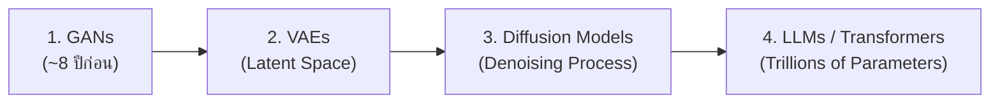

# 🎙️ บันทึกการบรรยายสดในชั้นเรียน: บทที่ 9 Modern AI & Generative AI

> **บันทึกจากการบรรยายในห้องเรียน (ไฟล์เสียง 6 ตอน)**  
> **วิชา:** ปัญญาประดิษฐ์ (Artificial Intelligence)  
> **หัวข้อ:** วิวัฒนาการของ Generative Models, สถาปัตยกรรม Transformer / LLMs, เทคนิค Prompt Engineering, Case Study งานวิจัย และประเด็นจริยธรรม  

---

## 1. วิวัฒนาการของโมเดลเชิงสร้างสรรค์ (Generative Models Evolution)

### 1.1 ยุคที่ 1: GAN (Generative Adversarial Network)
* **จุดเริ่มต้น:** เริ่มต้นเมื่อประมาณ 8 ปีก่อน ยุคแรกสร้างความตื่นเต้นมาก เช่น การสลับม้าลายเป็นม้าธรรมดา, ม้าธรรมดาเป็นม้าลาย (CycleGAN / Pix2Pix), การสลับฉากกลางวัน-กลางคืน, การเปลี่ยนฤดูกาล
* **หลักการทำงาน (2 เครือข่ายแข่งขันกัน):**
  * **Generator (ตัวสร้าง):** สุ่ม Noise เข้ามาแล้วพยายามสังเคราะห์ภาพเลียนแบบของจริง
  * **Discriminator (ตัวตรวจจับ):** ทำหน้าที่เสมือนนักสืบ ตรวจสอบว่าภาพที่ได้รับเป็นภาพจริงหรือภาพปลอม
  * **การเรียนรู้สลับกัน (Alternating Training):** สลับกันเรียนรู้ไปเรื่อยๆ จนกระทั่ง Generator สามารถสร้างภาพที่หลอก Discriminator ได้
  * **การนำไปใช้งานจริง:** ดึงเฉพาะ **Generator** ไปใช้งาน ส่วน Discriminator จะถูกตัดทิ้ง
* **ข้อจำกัด:** ภาพในยุคนั้นยังมีความเบลอ มีจุดแปลกๆ และการฝึกบางครั้งล้มเหลว (Mode Collapse) ไม่สามารถสร้างภาพออกมาได้

### 1.2 ยุคที่ 2: VAE (Variational Autoencoder)
* **หลักการ:** ใช้ **Encoder** บีบอัดข้อมูลภาพต้นฉบับลงสู่ **Latent Space ($Z$)** ซึ่งเป็นพื้นที่เก็บข้อมูลสำคัญในรูปค่า Mean ($\mu$) และ Standard Deviation ($\sigma$) จากนั้นใช้ **Decoder** แปลงกลับมาเป็นภาพ
* **ข้อจำกัด:** ไม่ได้รับความนิยมในงานสร้างภาพคุณภาพสูงเท่า GAN เนื่องจากภาพที่ได้ยังมีความคมชัดและความสมจริงน้อยกว่า

### 1.3 ยุคที่ 3: Diffusion Models (มาตรฐานของโมเดลสร้างภาพในปัจจุบัน)
* **จุดเด่น:** ยุคก้าวกระโดดที่ให้ภาพคมชัดและสมจริงสูงสุด แต่เป็นโมเดลที่ **กินแรมการ์ดจอ (VRAM) มหาศาล** แม้แต่การ์ดจอระดับท็อปอย่าง RTX 4090 หรือ RTX 5090 หากนำมาใช้เทรนหรือสร้างโมเดลขนาดใหญ่ก็ยังทำงานลำบาก
* **กระบวนการทำงาน 2 สเต็ป:**
  1. **Forward Process (การทำลายภาพ):** ค่อยๆ เติม Noise (Gaussian Noise) ลงในภาพจริงทีละระดับ จนกลายเป็น Pure Noise
  2. **Reverse / Denoising Process (การถอด Noise):** โมเดลเรียนรู้การขจัด Noise ออกทีละขั้น โดยมี Text Prompt และ Conditioning นำทางจนกู้คืนกลับมาเป็นภาพใหม่
* **ข้อจำกัด:** ทำงาน **ช้ากว่า GAN มาก** เนื่องจากต้องคำนวณถอด Noise ซ้ำหลายสเต็ป

---

## 🌟 2. เคสศึกษาจริงจากอาจารย์: โครงการ AI ฟิล์ม X-ray ทันตกรรม (Dental X-Ray Project)

อาจารย์ได้ยกตัวอย่างงานวิจัยจริงที่ร่วมมือกับทันตแพทย์ เพื่อแสดงประโยชน์ของการใช้ Diffusion Model ในโลกจริง:

| ประเด็น | รายละเอียด |
| :--- | :--- |
| **โจทย์วิจัย** | วินิจฉัยโรคเหงือก/ฟันจากภาพฟิล์ม X-ray แบ่งออกเป็น 3 คลาส: **(1) ปกติ, (2) รักษาได้, (3) ต้องถอนทิ้ง** |
| **ปัญหาที่พบ** | ชุดข้อมูลเริ่มต้นมีภาพจริงเพียงประมาณ **1,000 ภาพ** ทำให้เทรนโมเดลแล้วได้ความแม่นยำต่ำมากเพียง **50% - 65%** |
| **ข้อจำกัดด้านต้นทุนเวลาและงบประมาณ** | การประเมินฟิล์ม X-ray 1,000 ภาพ ต้องใช้ทันตแพทย์ 3 คนตรวจร่วมกัน ภาพละ 5 นาที คิดเป็นเวลา $1,000 \times 5 \times 3 = 15,000$ นาที *(หากคิดค่าเสียโอกาสในการรักษา เช่น การถอนฟัน 1 ซี่ใช้เวลาไม่เกิน 10 นาที ค่าบริการ 500 บาท มูลค่าเวลาในการ Label ข้อมูลมีมูลค่าเกือบ 1 ล้านบาท)* |
| **แนวทางการแก้ปัญหา** | อาจารย์นำ **Diffusion Model** มาเรียนรู้โครงสร้างของฟิล์ม X-ray และทำการ **Generate ภาพฟิล์ม X-ray สังเคราะห์เพิ่มขึ้นมา (Data Augmentation)** เพื่อขยาย Dataset ให้มีปริมาณมากพอ จนทำให้ AI แม่นยำขึ้น |

---

## 3. สถาปัตยกรรม Transformer และ Large Language Models (LLMs)

### 3.1 ขนาดพารามิเตอร์และการเทรน
* ขยับจากหลักร้อยล้านพารามิเตอร์ จนปัจจุบันทะลุ **10+ Trillion Parameters** (เช่น GPT-4, LLaMA 3, Claude, Gemini)
* ไม่สามารถเทรนบนเครื่องคอมพิวเตอร์ส่วนบุคคลได้ โมเดลที่เล็กที่สุดที่พอเทรนได้ต้องใช้การ์ดจอระดับองค์กร เช่น **NVIDIA A100 (10 ใบขึ้นไป)** ซึ่งมีราคาสูงมากระดับหลักสิบล้าน

### 3.2 การเปรียบเทียบ AI Assistant ในมุมมองของอาจารย์
* **งานจัดทำเอกสารวิชาการ:** **Claude** มีความโดดเด่นสูงสุด จัดหน้า รายงาน เล่มโปรเจกต์ และฟอนต์ได้อย่างเป็นระเบียบและเป๊ะมาก
* **งานเขียนโปรแกรม (Code Generation) บน Antigravity IDE:**
  * **Gemini บน Antigravity IDE:** ทำงานได้รวดเร็ว ฉลาด ประหยัด Token สูง ไม่เขียน Test ให้โดยอัตโนมัติเว้นแต่ผู้ใช้จะสั่ง ทำให้ทำงานจบได้ใน 1 Session Limit
  * **Claude:** มักจะสร้าง Test Case และ Unit Test มาให้ด้วยโดยอัตโนมัติ ทำให้โค้ดมีบั๊กน้อย แต่มีข้อเสียคือกิน Token มหาศาลและทำงานช้ากว่า ทำให้โควต้า Pro อาจหมดได้ภายในไม่กี่ชั่วโมง

### 3.3 Tokenization และ Word Embedding
* ตัวอักษรและข้อความจะถูกตัดแบ่งเป็น **Tokens** และแปลงเป็นเวกเตอร์ตัวเลขที่มีมิติสูง (512 ถึง 4,096 มิติ)
* เวกเตอร์มีความสัมพันธ์ทางความหมาย (Semantic Similarity) ที่สามารถคำนวณได้:
  $$\vec{\text{King}} - \vec{\text{Man}} + \vec{\text{Woman}} \approx \vec{\text{Queen}}$$

### 3.4 Transformer และ Attention Mechanism
* ตีพิมพ์ในเปเปอร์ *"Attention Is All You Need"* (2017) เข้ามาปฏิวัติวงการ NLP แทนที่ RNN/LSTM
* **องค์ประกอบ Q, K, V:**
  * **Query ($Q$):** คำสั่งหรือคำค้นหาที่ป้อนเข้าไป
  * **Key ($K$):** พารามิเตอร์หรือดัชนีของเนื้อหา
  * **Value ($V$):** ค่าผลลัพธ์หรือสาระสำคัญที่ต้องการ
* **Attention Score:** ตัวอย่างประโยค *"The animal didn't cross the street because it was too tired."* โมเดลจะคำนวณ Attention Score และเชื่อมโยงได้ถูกต้องว่าคำว่า *"it"* อ้างอิงถึง *"animal"*

---

## 4. วิศวกรรมคำสั่ง (Prompt Engineering)

### 4.1 องค์ประกอบของ Prompt ที่มีประสิทธิภาพ
1. **Role (บทบาท):** ระบุว่าเราเป็นใคร หรือให้ AI สวมบทบาทใด เช่น *"Act as Senior Developer (Node.js, Next.js, Go)"*
2. **Task (งาน):** ระบุสิ่งที่ต้องการอย่างชัดเจน
3. **Format (รูปแบบ):** ระบุรูปแบบผลลัพธ์ เช่น 3 ย่อหน้าสั้นๆ, ตาราง Markdown, JSON
4. **Constraint (ข้อจำกัด):** กำหนดเงื่อนไข เช่น ภาษาที่เข้าใจง่าย พร้อมยกตัวอย่างจริงประกอบ

### 4.2 เทคนิคการ Prompt
* **Zero-shot:** สั่งงานโดยตรงโดยไม่มีตัวอย่าง
* **Few-shot:** ใส่ตัวอย่างคำถาม-คำตอบนำทาง เพื่อให้โมเดลเข้าใจแพทเทิร์น
* **Chain of Thought (CoT) / Reasoning:** การให้โมเดลคิดหาเหตุผลเป็นขั้นเป็นตอน แตกโจทย์เป็นข้อย่อยๆ คิดทีละสเต็ปแล้วนำมารวมกัน (เช่น โมเดลสาย Reasoning อย่าง DeepSeek หรือ OpenAI o-series) ส่งผลให้แก้โจทย์ตรรกะได้ดีขึ้น แต่กิน Token สูงและตอบช้าลง

---

## 5. ข้อจำกัดและประเด็นทางจริยธรรมของ AI (AI Ethics & Constraints)

1. **Hallucination:** AI สร้างข้อมูลเท็จอย่างมั่นใจ จำเป็นต้องมีการตรวจสอบข้อเท็จจริง (Fact-check) เสมอ
2. **Bias:** อคติที่แฝงมากับชุดข้อมูลฝึกสอน
3. **Privacy:** ความปลอดภัยของข้อมูลส่วนบุคคล (PII) และความลับทางการค้า ห้ามป้อนข้อมูลละเอียดอ่อนลงใน Public AI
4. **Environmental Impact:** การเทรนและการรันโมเดลขนาดใหญ่ใช้พลังงานไฟฟ้าและน้ำระบายความร้อนมหาศาล ส่งผลกระทบต่อสภาวะโลกร้อน (มีประเด็นเรื่อง AI กินพลังงานแซงหน้าเหมืองคริปโต)
5. **Misinformation:** การสร้างข่าวปลอมและสื่อสังเคราะห์ที่ยากต่อการแยกแยะ
6. **Copyright & IP (ทรัพย์สินทางปัญญา):** การนำผลงานและลายเส้นของศิลปินไปเทรนโดยไม่ได้รับความยินยอม และความไม่ชัดเจนในเรื่องกรรมสิทธิ์ผลงานที่สร้างจาก AI

---

## 6. ลิงก์เชื่อมโยงที่เกี่ยวข้อง
* 📖 [สรุปบทที่ 9 ฉบับเนื้อหาเต็มและแนวข้อสอบ 16 ข้อ](file:///d:/3term1/AI/notes/09_บทที่_9_การเรียนรู้ยุคใหม่.md)
* 🧪 [แบบฝึกหัดปฏิบัติการ CNN CIFAR-10 (Lab 10)](file:///d:/3term1/AI/แลบ/lab10/main.ipynb)
* 📑 [สารบัญสรุปวิชา AI ทั้งหมด](file:///d:/3term1/AI/notes/README_สารบัญสรุปวิชา_AI.md)
