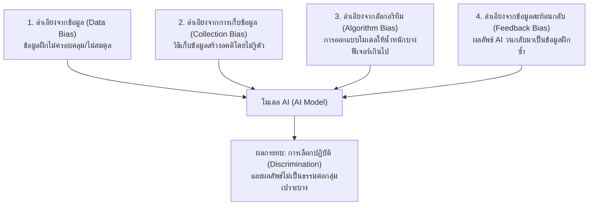
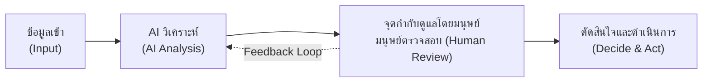
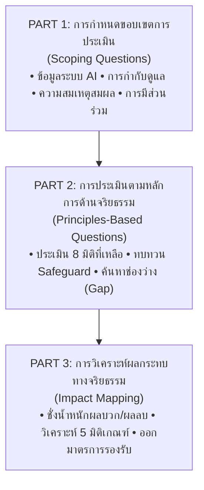

# สรุปบทที่ 10: จริยธรรมในปัญญาประดิษฐ์ (Ethics in Artificial Intelligence)

---

## 📌 บทนำและภาพรวม (Overview & Importance)

เมื่อเทคโนโลยีปัญญาประดิษฐ์ (AI) โดยเฉพาะ **Generative AI** และ **Large Language Models (LLMs)** พัฒนาอย่างก้าวกระโดดและเข้าถึงผู้คนนับพันล้านคนทั่วโลก ความเสี่ยงและผลกระทบต่อบุคคล องค์กร และสังคมจึงทวีความสำคัญขึ้นอย่างมาก

> [!IMPORTANT]
> **Responsible AI (ปัญญาประดิษฐ์ที่รับผิดชอบ):**  
> คือชุดหลักการและแนวปฏิบัติที่ทำให้การพัฒนาและประยุกต์ใช้ AI เกิดประโยชน์ต่อสังคมอย่างยั่งยืน โดยไม่ก่อให้เกิดอันตรายต่อบุคคล กลุ่มคน สังคม หรือสิ่งแวดล้อม  
> **"ความรับผิดชอบของ AI เริ่มตั้งแต่วันแรกที่คุณนิยามปัญหา ไม่ใช่หลังจากโมเดลสร้างเสร็จ"**

### กรอบอ้างอิงหลักในระดับสากลและประเทศไทย
* **ระดับสากล (UNESCO):** ประกาศ *"Recommendation on the Ethics of Artificial Intelligence"* ในปี ค.ศ. 2021 ซึ่งได้รับการรับรองโดยประเทศสมาชิก 194 ประเทศ
* **ระดับประเทศไทย (ETDA / AIGPC):** สำนักงานพัฒนาธุรกรรมทางอิเล็กทรอนิกส์ (สพธอ. หรือ ETDA) ร่วมกับ ศูนย์ธรรมาภิบาลปัญญาประดิษฐ์ (AI Governance Clinic: AIGPC) จัดทำ **คู่มือการประเมินผลกระทบทางจริยธรรมปัญญาประดิษฐ์ (EIA)** ฉบับภาษาไทย
* **กฎหมายคุ้มครองข้อมูลส่วนบุคคล (PDPA พ.ศ. 2562):** กำกับดูแลการเก็บรวบรวม ใช้ และเปิดเผยข้อมูลส่วนบุคคล โดยเฉพาะข้อมูลอ่อนไหว (Sensitive Data) เช่น สุขภาพ ชีวมิติ และเชื้อชาติ

---

## 🧭 หลักการจริยธรรมปัญญาประดิษฐ์ 10 มิติ (UNESCO 10 Dimensions)

กรอบของ UNESCO กำหนดมิติจริยธรรมไว้ 10 ประการ โดยในการนำไปใช้งานจริงจะจัดกลุ่มตาม **ระดับของผลกระทบ (Scope of Impact)**:

| ลำดับมิติ (UNESCO) | ชื่อหลักการจริยธรรม (ภาษาไทย / อังกฤษ) | คำอธิบายสาระสำคัญ | ระดับของผลกระทบ / ขั้นตอนใช้งาน |
| :---: | :--- | :--- | :--- |
| **1** | **ความสมเหตุสมผลและการไม่ก่อให้เกิดอันตราย** *(Proportionality and Do No Harm)* | ใช้ AI ได้สัดส่วนกับวัตถุประสงค์ ไม่ละเมิดสิทธิมนุษยชน ห้ามจัดอันดับทางสังคม (Social Scoring) หรือสอดส่องประชาชน | **ขั้นกำหนดขอบเขต EIA** (ประเมินว่าควรใช้ AI หรือไม่) |
| **2** | **ความปลอดภัยและความมั่นคงปลอดภัย** *(Safety and Security)* | ระบบต้องน่าเชื่อถือ ป้องกันข้อผิดพลาด ป้องกันการโจมตีทางไซเบอร์ | **ระดับระบบ (System)** |
| **3** | **ความเป็นธรรม การไม่เลือกปฏิบัติ และความหลากหลาย** *(Fairness, Non-discrimination and Diversity)* | ปฏิบัติต่อทุกคนอย่างเท่าเทียม ไม่สร้างความเหลื่อมล้ำหรืออคติ | **ระดับข้อมูลและแบบจำลอง (Data & Model)** |
| **4** | **ความยั่งยืน** *(Sustainability)* | คำนึงถึงผลกระทบระยะยาวต่อสังคม เศรษฐกิจ และสิ่งแวดล้อม/พลังงาน | **ระดับองค์กรและสังคม (Organization & Society)** |
| **5** | **ความเป็นส่วนตัวและการคุ้มครองข้อมูล** *(Privacy and Data Protection)* | คุ้มครองข้อมูลตลอดวงจรชีวิต ออกแบบโดยคำนึงถึงความเป็นส่วนตัว (Privacy by Design) | **ระดับระบบ (System)** |
| **6** | **การกำกับดูแลและการตัดสินใจโดยมนุษย์** *(Human Oversight and Determination)* | มนุษย์ต้องตรวจสอบ ทบทวน แก้ไข หรือยกเลิกคำตัดสินของ AI ได้ | **ระดับระบบและองค์กร (System & Organization)** |
| **7** | **ความโปร่งใสและความสามารถในการอธิบาย** *(Transparency and Explainability)* | ผู้ใช้ต้องรู้ว่ามีการใช้ AI และสามารถเข้าใจเหตุผลของผลลัพธ์ได้ | **ระดับข้อมูลและแบบจำลอง (Data & Model)** |
| **8** | **ความรับผิดชอบและภาระรับผิด** *(Accountability and Responsibility)* | ความรับผิดชอบต้องผูกพันกับมนุษย์เสมอ ตรวจสอบและสืบย้อนกลับได้ | **ระดับระบบและองค์กร (System & Organization)** |
| **9** | **ความตระหนักรู้และความรู้ความสามารถ** *(Awareness and Literacy)* | ส่งเสริมทักษะ ความเข้าใจข้อจำกัด AI ป้องกันการพึ่งพา AI มากเกินไป | **ระดับสังคม (Society)** |
| **10** | **การกำกับดูแลที่ปรับตัวได้และการมีส่วนร่วม** *(Multi-stakeholder and Adaptive Governance)* | เปิดรับฟังผู้มีส่วนได้ส่วนเสียและกลุ่มเปราะบาง ปรับกลไกตามเทคโนโลยี | **ระดับสังคม** และ **ขั้นกำหนดขอบเขต EIA** |

---

## 🔍 เจาะลึกหลักการสำคัญรายมิติ (Key Ethical Principles in Practice)

### 1. ความเป็นธรรมและความลำเอียง (Fairness & Bias) – มิติที่ 3
ความลำเอียง (Bias) เกิดขึ้นได้ในทุกช่วงของการพัฒนา AI แบ่งออกเป็น **4 แหล่งที่มาสำคัญ**:

* **ตัวอย่างประวัติศาสตร์ (Amazon 2018):** AI คัดเลือกเรซูเม่ผู้สมัครงานให้คะแนนผู้หญิงต่ำกว่าผู้ชาย เพราะเทรนด้วยข้อมูลย้อนหลัง 10 ปี ซึ่งสะท้อนโครงสร้างเดิมของอุตสาหกรรมเทคที่มีพนักงานชายเป็นส่วนใหญ่
* **ข้อเตือนใจ:** *ค่าความแม่นยำ (Accuracy) รวมที่สูง ไม่ได้รับประกันว่าโมเดลจะมีความเป็นธรรม! ต้องวัดแยกตามกลุ่มประชากร (Subgroup Evaluation)*

---

### 2. ความโปร่งใสและความสามารถในการอธิบาย (Transparency & Explainability) – มิติที่ 7
* **ความโปร่งใส (Transparency):** การเปิดเผยให้ผู้ใช้ทราบว่า **"ระบบทำงานอย่างไร และมีการนำ AI มาใช้"**
* **ความสามารถในการอธิบาย (Explainability):** ความสามารถในการอธิบายว่า **"เหตุใดระบบจึงให้ผลลัพธ์เช่นนั้นในรายกรณีเฉพาะ"** (เพื่อให้ผู้ได้รับผลกระทบเข้าใจและใช้สิทธิ์โต้แย้งได้)

| คุณลักษณะ | โมเดลที่อธิบายได้ง่าย (Interpretable / White-Box) | โมเดลที่อธิบายได้ยาก (Black-Box Model) |
| :--- | :--- | :--- |
| **ตัวอย่างโมเดล** | ต้นไม้ตัดสินใจ (Decision Tree), การถดถอยเชิงเส้น (Linear Regression) | โครงข่ายประสาทเทียมเชิงลึก (Deep Neural Network / LLM) |
| **จุดเด่น** | เห็นเส้นทางและเงื่อนไขการตัดสินใจชัดเจน (If-Else Rules) | ความแม่นยำสูงมาก รองรับข้อมูลซับซ้อน มิติสูง |
| **ข้อจำกัด** | ขีดความสามารถในการจำลองฟังก์ชันซับซ้อนจำกัด | พารามิเตอร์นับพันล้านตัว ทำให้ยากต่อการอธิบายเหตุผลเบื้องหลังรายตัว |

---

### 3. ความเป็นส่วนตัวและความปลอดภัย (Privacy & Security) – มิติที่ 5 และ 2
* **ด้านความเป็นส่วนตัว (Privacy):**
  * **Data Minimization:** เก็บข้อมูลเฉพาะที่จำเป็นตามวัตถุประสงค์
  * ขอความยินยอมตามมาตรฐาน **PDPA**
  * เข้ารหัสข้อมูล (Encryption) ระหว่างรับส่ง
  * ทำ **Anonymization / Pseudonymization** ก่อนนำข้อมูลไปเทรนโมเดล
  * ระวังการรั่วไหลของข้อมูลความลับผ่านการป้อน Prompt
* **ด้านความมั่นคงปลอดภัย (Security Attacks):**
  1. **Adversarial Attack:** การป้อนข้อมูลรบกวนเล็กน้อยที่ตามนุษย์มองไม่เห็น แต่หลอกให้โมเดลทำนายผิดพลาดอย่างสิ้นเชิง
  2. **Model Poisoning:** การแทรกข้อมูลอันตรายลงในชุดข้อมูลฝึกสอนเพื่อวางช่องโหว่ (Backdoor)
  3. **Model Stealing:** การขโมยโครงสร้างหรือพารามิเตอร์ของโมเดลผ่านการ Query ซ้ำๆ
  4. **Privacy Attack (Membership Inference / Extraction):** การดึงข้อมูลส่วนบุคคลที่โมเดลจดจำไว้ออกมาจากตัวโมเดล

---

### 4. ความรับผิดชอบและการกำกับดูแลโดยมนุษย์ (Accountability & Oversight) – มิติที่ 8 และ 6
* **AI ไม่มีสถานะทางกฎหมาย** ดังนั้น ความรับผิดชอบต่อความเสียหาย **ต้องผูกพันกับมนุษย์เสมอ** แบ่งออกเป็น 4 บทบาท:
  1. **ผู้พัฒนาโมเดล (Model Developer):** ผู้คัดเลือกข้อมูล สถาปัตยกรรม และฝึกโมเดล
  2. **ผู้พัฒนาระบบ (System Developer):** ผู้เชื่อมโยงโมเดลเข้ากับระบบแอปพลิเคชันและการทำงาน
  3. **องค์กรผู้นำไปใช้ (Organization):** องค์กรที่นำ AI ไปเป็นส่วนหนึ่งของกระบวนการธุรกิจ/บริการ
  4. **ผู้ใช้งาน (User):** มนุษย์ที่มีส่วนร่วมในการตัดสินใจขั้นสุดท้าย
* **Human-in-the-loop (HITL):**

> [!TIP]
> จำเป็นอย่างยิ่งในระบบที่มี **ผลกระทบสูง (High-Stake Decisions)** เช่น การวินิจฉัยโรคทางการแพทย์, การอนุมัติสินเชื่อ, และระบบกระบวนการยุติธรรม

---

### 5. ความยั่งยืนของระบบปัญญาประดิษฐ์ (Sustainability) – มิติที่ 4
ความยั่งยืนครอบคลุมทั้งมิติด้านสิ่งแวดล้อมและสังคม-เศรษฐกิจ:
1. **ผลกระทบด้านสิ่งแวดล้อม:**
   * การเทรนและการทำ Inference ของ LLM ใช้พลังงานไฟฟ้าและน้ำหล่อเย็นในศูนย์ข้อมูล (Data Center) มหาศาล ก่อให้เกิด Carbon Footprint สูง
   * **แนวทางแก้ไขเชิงเทคนิค:**
     * ใช้ **Transfer Learning** (นำโมเดลที่ฝึกมาแล้วมา Fine-tune) แทนการเทรนใหม่ตั้งแต่ศูนย์
     * ลดขนาดโมเดลด้วยเทคนิค **Quantization, Pruning** และ **Knowledge Distillation**
     * เลือกขนาดโมเดลให้เหมาะสมกับงาน (Right-sizing)
2. **ผลกระทบด้านสังคมและเศรษฐกิจ:**
   * การแทนที่แรงงานในงานลักษณะทำซ้ำ (Routine Tasks)
   * องค์กรต้องเตรียมแผน **Reskilling / Upskilling** ให้บุคลากร
   * ป้องกันปัญหาความเหลื่อมล้ำทางดิจิทัล (Digital Divide)

---

### 6. ความตระหนักรู้และการมีส่วนร่วม (Awareness & Multi-stakeholder) – มิติที่ 9 และ 10
* **Automation Bias:** พฤติกรรมที่ผู้ใช้เชื่อมั่นและยอมรับการตัดสินใจของ AI โดยไม่ตรวจสอบซ้ำ แม้ผลลัพธ์จะผิดอย่างชัดเจน (แก้ไขด้วยการอบรมให้ตระหนักถึงข้อจำกัดของระบบ)
* **ขั้นตอนการจัดตั้งทีมประเมินตามคู่มือ ETDA (6 ขั้นตอน):**
  1. กำหนดผู้รับผิดชอบโครงการ (Project Manager)
  2. จัดตั้งทีมประเมินที่มีความหลากหลาย (เทคนิค, กฎหมาย, สังคม, ธุรกิจ)
  3. ประเมินในส่วนที่รับผิดชอบตามความเชี่ยวชาญของแต่ละคน
  4. จัดประชุมเชิงปฏิบัติการร่วมกัน (Collaborative Workshop)
  5. เปิดให้ผู้มีส่วนได้ส่วนเสียและกลุ่มเปราะบางมีส่วนร่วม (Stakeholder Engagement)
  6. สรุปผลและกำหนดแนวทางดำเนินงาน

---

## 📊 การประเมินผลกระทบทางจริยธรรมปัญญาประดิษฐ์ (Ethical Impact Assessment: EIA)

> [!NOTE]
> EIA **ไม่ได้ทำหน้าที่ตัดสินว่าระบบ "ผ่าน" หรือ "ไม่ผ่าน"**  
> แต่มุ่งสร้างความโปร่งใส ชั่งน้ำหนักความเสี่ยงกับประโยชน์ และวางมาตรการลดผลกระทบ (Mitigation Measures)

### เกณฑ์การวิเคราะห์ผลกระทบ 5 ด้าน (Impact Analysis Criteria)
เกณฑ์เหล่านี้ใช้บันทึกเหตุผลและเปรียบเทียบผลกระทบ **ไม่ใช่การนำมาคำนวณรวมเป็นตัวเลขคะแนน**:

1. **ระดับของผลกระทบ (Scale):** 
   * เชิงบวก: สูงมาก / สูง / ปานกลาง / เล็กน้อย
   * เชิงลบ: ร้ายแรงอย่างยิ่ง (Catastrophic) / วิกฤต (Critical) / รุนแรง (Serious) / เล็กน้อย
2. **ผู้ได้รับผลกระทบ (Impacted Parties):** ได้รับผลโดยตรง (Primary), โดยอ้อม (Secondary), หรือไม่คาดการณ์ไว้ (Unexpected)
3. **ระยะเวลา (Timescale):** ระยะสั้น, ระยะกลาง, ระยะยาว, ข้ามรุ่น (Intergenerational)
4. **ความสามารถในการเยียวยา (Remediability):** ใช้เฉพาะผลกระทบเชิงลบ (ต่ำมาก / ต่ำ / ปานกลาง / สูง) ว่าสามารถชดเชยหรือแก้ไขกลับคืนได้เพียงใด
5. **โอกาสเกิด (Likelihood):** ความน่าจะเป็นที่จะเกิดขึ้น (สูงมาก / สูง / ปานกลาง / ต่ำ)

### ช่วงเวลาที่ต้องดำเนินกระบวนการ EIA (3 ช่วงสำคัญ)
1. **ก่อนนำไปใช้งาน (Before Deployment):** ช่วงเวลาที่สำคัญที่สุด (ระหว่างการออกแบบ วิจัย จัดหา)
2. **ระหว่างและหลังการใช้งาน (During & Post Deployment):** ติดตามตรวจสอบผลกระทบจริงและทบทวนสมมติฐาน
3. **เมื่อบริบทเปลี่ยนแปลง (When Context Changes):** เช่น มีการเปลี่ยนวัตถุประสงค์ เปลี่ยนกลุ่มผู้ใช้ แหล่งข้อมูลใหม่ หรือกฎหมายใหม่

---

## 🏥 กรณีศึกษาตัวอย่าง: AI คัดกรองผู้ป่วยนอกของโรงพยาบาลรัฐ

ระบบรับข้อมูลอาการ สัญญาณชีพ และประวัติเบื้องต้น เพื่อจัดลำดับความเร่งด่วน 3 ระดับ ช่วยพยาบาลคัดกรอง:

| มิติทางจริยธรรม | ผลกระทบเชิงลบที่ตรวจพบ | ผลการประเมิน (ระดับ / โอกาส / การเยียวยา) | มาตรการลดผลกระทบ (Mitigation Safeguards) |
| :--- | :--- | :---: | :--- |
| **ความเป็นธรรม** | ผู้สูงอายุและผู้พูดภาษาไทยไม่ได้ ถูกจัดระดับเร่งด่วนต่ำกว่าจริง | **วิกฤต / ปานกลาง / ต่ำ** | ทดสอบความแม่นยำแยกกลุ่มประชากร, เพิ่ม Data จาก รพ. อื่น |
| **การกำกับดูแลโดยมนุษย์** | พยาบาลเชื่อผล AI โดยไม่ตรวจสอบ (Automation Bias) | **วิกฤต / สูง / ปานกลาง** | อบรมพยาบาล, บันทึก Log การ Overrule คำตัดสิน, ทบทวนรายเดือน |
| **ความโปร่งใส** | ผู้ป่วยไม่รู้ว่าใช้ AI และไม่มีการอธิบายเหตุผล | **รุนแรง / สูง / สูง** | ติดป้ายประกาศแจ้งชัดเจน, แสดงปัจจัย Top 3 ที่ระบบใช้ประเมิน |
| **ความรับผิดชอบ** | ไม่มีผู้รับผิดชอบชัดเจนเมื่อคัดกรองผิดพลาด | **รุนแรง / ปานกลาง / ปานกลาง** | ให้พยาบาลรับผิดชอบขั้นสุดท้าย, ทำ Audit Trail, เปิดช่องร้องเรียน |
| **ความเป็นส่วนตัว** | ข้อมูลสุขภาพอ่อนไหวถูกจัดเก็บนานเกินความจำเป็น | **รุนแรง / ปานกลาง / ต่ำ** | กำหนด Retention Period, จำกัดสิทธิ์ตาม Role (RBAC) ตาม PDPA |

* **ข้อสรุปกรณีศึกษา:** *ยังไม่ควรเปิดใช้งานระบบเต็มรูปแบบ จนกว่าจะดำเนินมาตรการลดผลกระทบครบถ้วน แล้วจึงทดลองใช้ในวงจำกัด (Pilot Phase)*

---

## 💻 การใช้ AI อย่างรับผิดชอบในการเขียนโค้ด (Responsible AI for Developers)

สำหรับโปรแกรมเมอร์ที่ใช้งาน AI Assistant (เช่น GitHub Copilot, ChatGPT, Claude):
* **Do's & Don'ts:**
  1. **ต้องเข้าใจโค้ดทุกบรรทัด** ก่อนนำไปรันจริง ห้ามนำโค้ดที่ไม่เข้าใจไป Deploy
  2. ตรวจสอบ **Edge Cases** และความปลอดภัย เพื่อดักจับอาการ **Hallucination** ของ AI
  3. **ห้ามใส่ API Keys, Passwords หรือข้อมูลส่วนบุคคล (PII)** ลงในกล่องคำสั่ง (Prompt)
  4. ตรวจสอบ **License และสิทธิ์ทางปัญญา** ของโค้ดและไลบรารีที่ AI แนะนำ
* **สิ่งที่ AI เข้ามาแทนที่ไม่ได้:**
  * ความเข้าใจพื้นฐานทางวิทยาการคอมพิวเตอร์และคณิตศาสตร์
  * ทักษะการคิดวิเคราะห์และการแก้ปัญหาเชิงสร้างสรรค์
  * การตัดสินใจทางจริยธรรมและความรับผิดชอบต่อผู้ใช้งานและสังคม

---

## 📝 แนวข้อสอบและคำถามทบทวนท้ายบท (Exam Review & Exercises)

<b>คลิกเพื่อดูแนวทางคำตอบแบบฝึกหัดท้ายบทที่ 10 (ข้อ 1 - 8)</b>

1. **หลักการ 10 มิติของ UNESCO และมิติที่ใช้ในขั้นกำหนดขอบเขต:**  
   *ประกอบด้วย:* 1. สมเหตุสมผล 2. ปลอดภัย 3. เป็นธรรม 4. ยั่งยืน 5. เป็นส่วนตัว 6. กำกับโดยมนุษย์ 7. โปร่งใส 8. รับผิดชอบ 9. ตระหนักรู้ 10. มีส่วนร่วม  
   *มิติที่ใช้ในขั้นกำหนดขอบเขต (Scoping):* **มิติที่ 1** (ความสมเหตุสมผลและไม่ก่ออันตราย) และ **มิติที่ 10** (การมีส่วนร่วมหลากหลายภาคส่วน)
2. **แหล่งที่มาของความลำเอียง 4 แหล่ง พร้อมแนวทางแก้ไข:**  
   * Data Bias (เพิ่มข้อมูลกลุ่มน้อย), Collection Bias (ขยายช่องทางเก็บข้อมูลให้ทั่วถึง), Algorithm Bias (ปรับจูน Loss Function และ Weights ให้เป็นกลาง), Feedback Bias (คอยคัดกรองข้อมูลก่อนนำวนกลับมาเทรนใหม่)
3. **ความต่างระหว่าง Transparency vs Explainability:**  
   * *Transparency:* เปิดเผยการทำงานโดยรวมและแจ้งให้ทราบว่าใช้ AI  
   * *Explainability:* อธิบายเหตุผลเบื้องหลังคำตอบเฉพาะรายบุคคล (เช่น Decision Tree อธิบายง่ายผ่านกิ่ง If-Else ส่วน Deep NN เป็น Black Box อธิบายยาก)
4. **กระบวนการ EIA 3 ส่วน และช่วงเวลาที่ควรทำ:**  
   * 3 ส่วน: 1. กำหนดขอบเขต 2. ประเมินตามหลักการ 3. วิเคราะห์ผลกระทบ  
   * ช่วงเวลา: แนะนำที่สุดคือ **ก่อนนำไปใช้งาน (Before Deployment)**, ติดตาม **ระหว่างและหลังใช้งาน**, และ **เมื่อบริบทเปลี่ยนแปลง**
5. **เหตุผลที่ Remediability ใช้เฉพาะผลกระทบเชิงลบ:**  
   * เพราะคำว่า "การเยียวยา/ฟื้นฟู (Remediation)" หมายถึงการชดเชยความเสียหายหรือทำให้กลับคืนสู่สภาพเดิม ซึ่งเป็นเรื่องของความเสียหาย (เชิงลบ) ส่วนผลเชิงบวกไม่มีความเสียหายที่ต้องเยียวยา
6. **Automation Bias ในระบบ Human-in-the-loop และการป้องกัน:**  
   * คือภาวะที่มนุษย์เชื่อและปล่อยผ่านผลลัพธ์ของ AI โดยไม่ตรวจทานความถูกต้อง  
   * ป้องกันโดย: บังคับให้มนุษย์ต้องกดยืนยันเหตุผล, สุ่มส่งเคสทดสอบมาประเมินความตื่นตัว, แสดง Confidence Score, และกำหนดให้มี Audit ตรวจสอบย้อนหลัง
7. **ผลกระทบด้านความยั่งยืนของ LLM และแนวทางลดผลกระทบ 3 ข้อ:**  
   * ผลกระทบ: สิ้นเปลืองไฟฟ้า ปล่อยคาร์บอน ใช้น้ำหล่อเย็นศูนย์ข้อมูลมหาศาล  
   * แนวทางลด: 1. ใช้โมเดลขนาดเหมาะสม (Right-sizing) 2. ใช้ Transfer Learning แทนเทรนใหม่ 3. ลดขนาดด้วย Quantization หรือ Pruning

---

## 🔗 เอกสารอ้างอิงและเนื้อหาเชื่อมโยง
* สไลด์ประกอบการสอน: [Chapter-10-Ethics.pdf](file:///d:/3term1/AI/สไลด์/Chapter-10-Ethics.pdf)
* เอกสารตำราฉบับเต็ม: [บทที่ 10c - Ethics.pdf](file:///d:/3term1/AI/เอกสาร/บทที่%2010c%20-%20Ethics.pdf)
* สารบัญรวมวิชา AI: [README_สารบัญสรุปวิชา_AI.md](file:///d:/3term1/AI/notes/README_สารบัญสรุปวิชา_AI.md)
